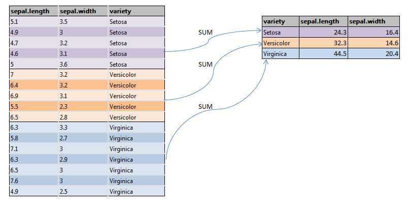

Welcome to WUDAC Analytics 201, Fall 2020! 

In this session, we will learn how to read in a dataset, clean it up, and manipulate it using a package called _dplyr_.

## 0. Packages

R packages are collections of functions developed by the R community
so you don't have to recode them again!

1) Dplyr (data manipulation, we will focus on this one)
2) Ggplot2 (data graphing and plotting)
3) Tidyr (data cleaning)
4) Tidyverse (mega package that includes packages like Dplyr, Tidyr, Ggplot2)
and many more ...

For this session, we'll need just four packages:

```{r}
library(dplyr)
library(lubridate)
library(tidyr)
```

If you get an error `there is no package called <PACKAGE NAME>’` for any of these packages, it is probably because you don't have the package(s) installed: run `install.packages(<PACKAGE NAME>)` to install the missing package(s).

## 0.5. Reading in data

We will be working with a wine dataset from the [UCI Machine Learning Repository](https://archive.ics.uci.edu/ml/index.php). Let's see how to read it into your R workspace.

[Click here](https://archive.ics.uci.edu/ml/machine-learning-databases/wine-quality/winequality-white.csv) to download the file containing the data.

```{r}
# First, move the the file to your desired folder location.
# Then, let's tell R where to find the file.

getwd() # this calls the current working directory

# If this is not where you want to save your work, change your path using the command below:
#setwd("C:/your/desired/path")
```
  
Once the file is in the right location, we can read in the dataset.
```{r}
# The file extension is .csv, so we use the classic read.csv() command

data <- read.csv('winequality-white.csv', sep = ';')

### Notice the "sep=';'" argument? That tells R to recognize ";" as the delimiter (typically, the delimiter is a comma, and we don't have to specify it.)
```

Note that read.csv also works quite well with URLs. For this specific example, since we are getting our data online, the following command will work as well. 

```{r}
# data <- read.csv('https://archive.ics.uci.edu/ml/machine-learning-databases/wine-quality/winequality-white.csv', sep=';')
```

Now we have our data stored in a variable, ready for use.
  
## 1. Intro to dplyr: select, filter, mutate

```{r}
head(data, 50)
```
Ew, that style looks bad. R isn't the best at printing data frames. Luckily, dplyr is.
```{r}
#turn it into a tibble (for better printing style)
data <- tbl_df(data)
print(data)
```
That looks a lot better! What we did was we changed the format of data to a __tibble__, which is a special type of data frame in dplyr that prints nicely. All rules of data frame still apply here.

###Select : chooses specific columns
```{r}
data.acid <- select(data, c(fixed.acidity, volatile.acidity, citric.acid, quality))
print(data.acid)
```
The format of select is select(Name of data frame, column names to select).

###Filter : choose rows based on specific conditions
```{r}
data.best <- filter(data, quality == 9)
print(data.best)
```
If there are multiple conditions, just separate them using comma

###Mutate: change or create new column
```{r}
data.good <- mutate(data, good = quality > 5)
print(data.good)
```

###pipes
If we want to string together several commands, there's a shortcut.
Prompt: return the acid-related columns of the highest quality (9) wine

Option 1: separate by steps
```{r}
data.best <- filter(data, quality == 9)
data.best.acid <- select(data.best, c(fixed.acidity, volatile.acidity, citric.acid, quality))
```

Option 2: piping (control + shift + M)
```{r}
data.best.acid <- filter(data, quality == 9) %>% select(c(fixed.acidity, volatile.acidity, citric.acid, quality))
  
```

Pipes '%>%' take the output from one function and feed it to the first argument of the next function. Pipes are imported through dplyr and can be used on any type of functions! 

```{r more pipes}
#very unconventional way of calculating 3+4+5
sum(3,4) %>% sum(5)
```

## 2. Joins
In the real data world, it's often rare that every piece of information you want is stored in a single dataframe. Usually, different concepts are stored in different dataframes. There are many reasons for doing so:

* If we have lots of data, we might not have enough storage to store all information in one place
* We might not need all the data at once, so keeping them separate will allow for faster computations
* ...

Hence, when we have two (or more) datasets, each storing pieces of information we want, join is often used to combine them.

```{r data, echo = F}
#read in data
students <- read.csv('students.csv', header = T)
colnames(students)[1] <- gsub('^...','',colnames(students)[1])

majors <- read.csv('majors.csv', header = T)
colnames(majors)[1] <- gsub('^...','',colnames(majors)[1])
```

```{r print}
print(students)
print(majors)
```

Say we want to find out what major each student has. We can't just get the data from any single dataset, so we need to put the two datasets together. For a join statement, there are 3 pieces of key information:

1. Type of join (to be discussed)
2. Names of the data frames
3. The columns on which the join takes place

The syntax for join in dplyr is: `joined_data <- type_of_join(df1, df2, by = "name of the column")`.

If the column(s) you're joining on have different names in the left- and right-hand tables, like we have here, you can use the `by` argument `c('<LEFT HAND COLUMN NAME>' = '<RIGHT HAND COLUMN NAME>')`:

```{r join}
joined_data <- inner_join(students, majors, by = c('MajorID'))
print(joined_data)
```

Combining with the select statement we discussed earlier, we can create a dataset with only the student name and their major:

```{r major}
student_major <- select(joined_data, c("Major_Name"))
print(student_major)
```

#### Types of Join
There are 4 common types of joins, which are: 

* `inner_join`: Returns records that have matching values in both tables
* `left_join`: Returns all records from the left table, and the matched records from the right table
* `right_join`: Returns all records from the right table, and the matched records from the left table
* `full_join`: Returns all records when there is a match in either left or right table

{width=50%}


It's important to recognize which type of join should be used in a query. For example, if we have a table of __people__ and a table of __allergies__ with speicfic allergy types and the poeple who have that type of allergy, to know what kind of allergies each person has, it's probably a wise idea to do a LEFT JOIN from __people__ to __allergies__ (i.e. keeping all records in people) since many won't have an allergy and won't show up in the __allergies__ table.


## 3. Merges

Merge has basically the same functionality of join. It uses base R instead of dplyr (in other words, you don't need to import any additional packages to use it). But join is designed to be a bit faster and work more efficiently than merge, so it's always recommended to use join over merge.

General merge syntax:
`merged_date <- merge(df1, df2, by = "name of column to join on", type of join)`.

More specifically, we have:

* `outer_join = merge(df1, df2, by = "colx", all = TRUE)`
* `left_join = merge(df1, df2, by = "colx", all.x = TRUE)`    
* `right_join = merge(df1, df2, by = "colx", all.y = TRUE)`

## 4. Group by

Suppose we want to see the average pH of all wines in the dataset. Then we can simply use

```{r}
mean(data$pH)
```

But what if we want to compute average pH **for each wine quality rating?** We need a couple important functions: `group_by()` and `summarize()`, which are both contained within the dplyr library.

```{r}
data %>%
  group_by(quality) %>%
  summarize(mean_pH = mean(pH))
```

As we can see above, `group_by()` creates a grouped table for each unique quality value. We then have to define how we want to summarize the values in each group. In this case, we used the `mean()` function, but we also could have used `sum()`:

```{r}
data %>%
  group_by(quality) %>%
  summarize(total_pH = sum(pH))
```

Or standard deviation:

```{r}
data %>%
  group_by(quality) %>%
  summarize(stddev_pH = sd(pH))
```

As long as our desired grouping is the same, we can create multiple summary columns at once; for example, say we want to look at both mean pH and mean density by quality:

```{r}
data %>%
  group_by(quality) %>%
  summarize(mean_pH = mean(pH), mean_density = mean(density))
```

Finally, here's a diagram explaining how `group_by()` works graphically.

{width=50%}


## 5. Tidying Data

```{r}
# Load Data
arrests = read.csv('arrestssample.csv') 
```

**Sampling data**

If our data set is too large, it becomes unwieldy to analyze even using R. To avoid this, we can often randomly sample the data to draw valid conclusions with less computing power.

We can sample by number of rows using `sample_n()` or by percentage of rows using `sample_frac()`:

```{r}
arrests.sample = sample_n(arrests, size = 9000)  # Specific number of rows; we'll use this dataset moving forward
arrests.samplefrac = sample_frac(arrests, 0.01)  # Specific fraction of rows
```

**Removing null values**

Many real-world datasets contain null values. We usually need to deal with these before analyzing the data. One common option is to remove them, for which we can use the `is.na()` function:

```{r}
# Drop all rows with NA values for sub_race
arrests.sample %>% filter(!is.na(sub_race))
```

**Filtering data**

We often only want to look at rows of the dataset that meet particular conditions. As shown below, we can use the `filter()` dplyr function to filter the data:

```{r}
# Arrests occurring from noon up until 8 PM
arrests.afternoon = arrests.sample %>% filter(hour >= 12 & hour < 20)

# Arrests occurring from 5AM up until noon
arrests.morning = arrests.sample %>% filter(hour >= 5 & hour <12)

# Arrests with the "violent" or "property" crime codes
arrests.violent.property = arrests.sample %>% filter(crime_code == c("violent", "property"))
```

**Combining/separating columns**

We may also want to combine columns, which we can do using the `unite()` function:

```{r}
# Combine race and gender columns
arrests.sample = unite(arrests.sample, sub_race, sub_gender, col = "race_and_gender", sep = " ") 
arrests.sample %>% group_by(race_and_gender) %>% count()
```

Or conversely, we may want to separate columns, which we can do using the `separate()` function:

```{r}
# Split this column back into the original two columns
arrests.sample = separate(arrests.sample, race_and_gender, sep = " ", into = c("sub_race", "sub_gender"))
```

**Renaming columns**

We can use the `rename()` function from dplyr to rename columns:

```{r}
# Rename off_id to officer_id
rename(arrests.sample, officer_id = off_id)  # Syntax is new name = old name
```

**Creating new columns**

We can use the `mutate()` function from dplyr to create new columns based on existing columns:

```{r}
# Create new is_afternoon column, which is 1 if the arrest occurred in the afternoon and 0 otherwise 
arrests.sample= arrests.sample %>% mutate(is_afternoon = if_else(hour >= 12, 1, 0))
```

**Formatting dates**

One thing that may be particularly useful to you in your final analysis is date formatting. In the raw data, the dates are in the form of a character vector, but we might be interested filtering based on month/year/etc, so we'll need to transform the dates into something that is more easily to work with in R.

Here, we'll use the `mdy()` function from the lubridate package we loaded earlier to parse these dates. We use `mdy()` because the dates are formatted MM/DD/YY in the data, but we might need to use a different function from the package for dates that are formatted differently (for example, we would use `dmy()` to parse dates of the form DD/MM/YY).

We can then use the `month()` function from the lubridate package to get the month from the date. lubridate also has `year()`, `wday()` (to get the day of the week), and other functions to get the various components of a date that may be useful for you.

```{r}
ArrestDates = mdy(arrests.sample$date) #Convert the data into the date class
head(month(ArrestDates), 10)  #Find the month that the arrests occurred in
```
