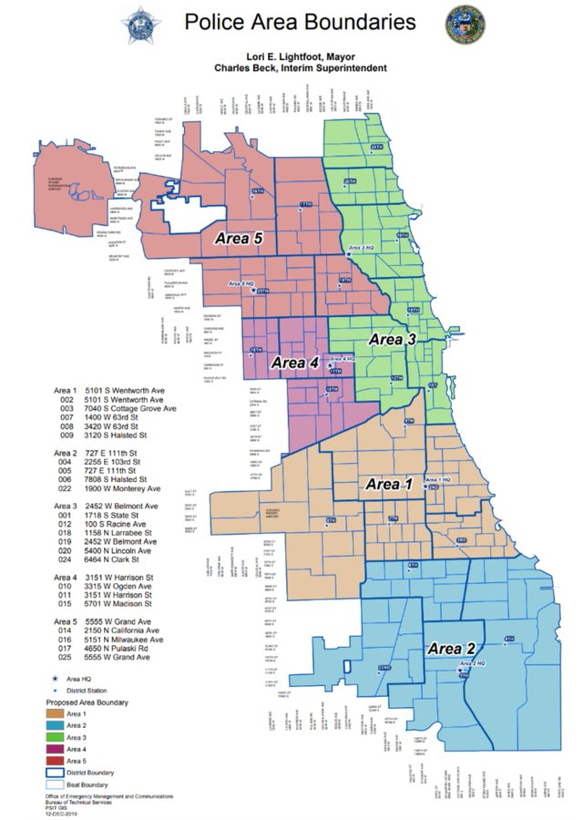

```{r setup, include=FALSE}
knitr::opts_chunk$set(echo = TRUE)
```

```{r, message=FALSE}
library(ggplot2)
library(dplyr)
library(magrittr)

# New libraries to work with shapefiles
# If you don't already have these libraries installed,
# uncomment and run lines 18 and 19
#install.packages('broom') 
#install.packages('rgdal')
library(broom)
library(rgdal)

# If you get an error about rlang when installing broom,
# run this to update rlang, then try again:
# You may need to quit and restart Rstudio afterwards.
#install.packages('rlang') 
```

# 0. `ggplot` (cont.)

See Session 3 materials.

# 1. Sample question

One question from Professor Knox:

> Spatial analysis: If you map policing activity by category/subcategory, are arrests for different types of crimes occurring at noticeably higher or lower frequencies in different parts of the city?

To answer this question: Create a geographic heatmap that shows number of arrests for each distinct crime type

For now, we will look only at the sampled arrests data (you will be looking at the full dataset in Sessions 6 and 7!).

```{r}
# Read in the data
arrests <- read.csv('arrestssample.csv')
```

**1. Create a geographic heatmap that shows number of arrests for each distinct crime type.**

The data dictionary tells us that the `crime_code` column is the "crime classification," so we can use this as the crime type. 

```{r}
# Get the different types of crimes
crime.types <- unique(arrests$crime_code)
crime.types
```

So, we have 7 total unique crime types in this data. (The data dictionary tells us that `TRF` is traffic, `WRT` is warrant, and `MCC` is the municipal code of Chicago.)

Since the `district` seems to be a more meaningful geographic variable than, say, latitude and longitude, we can plot a heatmap according to district boundaries. For this, we'll need the district shapefiles downloaded and in our working directory. We will also need the `broom` library.

```{r}
# Once you have the shapefiles in your working directory, this should run:
# Make sure you have broom installed and loaded!

districts <- readOGR(dsn=file.path('Boundaries - Police Districts (current)', 
                                   'geo_export_427fc6e8-19e2-4435-b9e4-0566a20fa39c.shp'))
summary(districts@data)
```

We can try making a very basic plot:

```{r, message=FALSE}
ggplot() + geom_polygon(data=districts, aes(x=long, y=lat, group=group), fill=NA, color='black') +
  coord_fixed() # Ensures 1:1 aspect ratio
```

To check that this is accurate, we can compare it to a map of Chicago from CBS Chicago (a local news channel):

{width=50%}

Now, we can make this basic map into a heatmap showing the frequency of the various crime types. For simplicity, we'll only show the process for the property crime type.

```{r}
# To create the map for a different crime type, just change this variable:
crime.type <- 'property'

# Only look at property crimes with non-null coordinates
property.crimes <- arrests %>% filter((crime_code == 'property') & (!is.na(lat)) & (!is.na(lon))) 

# Create dataframe from districts shapefile
districts.df <- broom::tidy(districts)
district.names <- aggregate(cbind(long, lat) ~ id, data=districts.df, FUN=mean)

# Plot
ggplot(property.crimes, aes(x=lon, y=lat)) + # Plot lat vs. long for property crimes
  stat_density2d(aes(fill = ..level..), alpha=0.5, geom='polygon') + # Create heatmap
  scale_fill_gradientn(colors=terrain.colors(10)) + # Set color gradient for heatmap
  geom_point(color='red', size=0.5, alpha=0.5) + # Put a red dot at the location of each crime
  geom_polygon(data=districts, aes(x=long, y=lat, group=group), fill=NA, color='gray')  + # Superimpose the district boundaries
  geom_text(data=district.names, aes(x=long, y=lat, label=id)) + # Label district
  coord_fixed()
```

It's not the prettiest map (we could certainly spend some time fine-tuning the placement of the labels), but we can generally see where more crimes are committed.

Maybe a cleaner way to visualize this would be by coloring each district according to the number of crimes:

```{r}
# Get property crimes per district
property.crimes.districts <- property.crimes %>%
  group_by(district) %>% 
  summarize(num_arrests=n()) %>%
  mutate(district=as.character(district))

# Merge with district shapefile
districts@data <- inner_join(property.crimes.districts, districts@data, by=c('district'='dist_num'))


# Plot
plot(districts, col=rgb((colorRamp(c("blue", "red"))(districts@data$num_arrests/max(districts@data$num_arrests)))/255))
```

Notably, the arrest numbers we computed based on the `district` attribute in the data (plotted above) don't seem to match up with the heatmap we plotted first. We should investigate more to see what happened here -- maybe district boundaries changed over time, maybe there's a mistake in the way the data was recorded, or maybe there's a mistake in our code!
